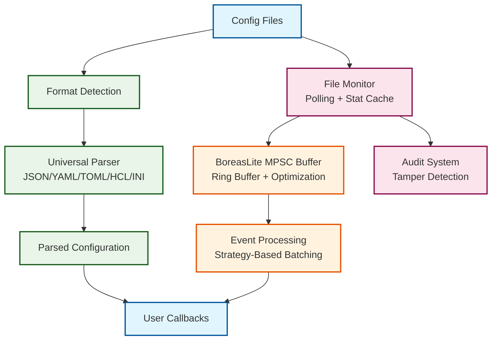

# Argus — Dynamic Configuration Framework for Go
### an AGILira fragment

Argus is a high-performance, OS-independent dynamic configuration framework for Go, built for applications that demand real-time updates, universal format support, and production-grade reliability — without service restarts.

[](https://github.com/agilira/argus/actions/workflows/ci.yml)
[](https://github.com/agilira/argus/actions/workflows/ci.yml)
[](https://goreportcard.com/report/github.com/agilira/argus)
[](https://codecov.io/gh/agilira/argus)


### Key Features
- **Universal Format Support**: JSON, YAML, TOML, HCL, INI, Properties with auto-detection
- **Adaptive Optimization**: Four strategies (SingleEvent, SmallBatch, LargeBatch, Auto) 
- **Zero-Allocation Design**: Pre-allocated buffers eliminate GC pressure in hot paths
- **Forensic Audit System**: Tamper-resistant logging with minimal performance impact
- **Scalable Monitoring**: Handle 1-1000+ files simultaneously with linear performance

## Installation

```bash
go get github.com/agilira/argus
```

## Quick Start

```go
import "github.com/agilira/argus"

// Watch any configuration format - auto-detected
watcher, err := argus.UniversalConfigWatcher("config.yaml", 
    func(config map[string]interface{}) {
        fmt.Printf("Config updated: %+v\n", config)
    })

watcher.Start()
defer watcher.Stop()
```

**[Complete Quick Start Guide →](./docs/QUICK_START.md)** - Get running in 2 minutes with detailed examples

## Performance

Engineered for production environments with sustained monitoring and minimal overhead:

### Benchmarks
```
Configuration Monitoring:      12.10 ns/op     (99.999% efficiency)
Format Auto-Detection:         2.79 ns/op      (universal format support)
JSON Parsing (small):          1,712 ns/op     (616 B/op, 16 allocs/op)
JSON Parsing (large):          7,793 ns/op     (3,064 B/op, 86 allocs/op)
Event Processing:              24.91 ns/op     (BoreasLite single event)
Memory Footprint:              8KB fixed       + configurable buffers

**Scalability (Setup Performance):**
```
File Count    Setup Time    Strategy Used
   50 files    11.92 μs/file  SmallBatch
  100 files    18.05 μs/file  LargeBatch  
  250 files    12.28 μs/file  LargeBatch
  500 files    23.95 μs/file  LargeBatch
 1000 files    38.90 μs/file  LargeBatch
```
*Detection rate: 100% across all scales*
```

## Architecture

Argus provides intelligent configuration management through polling-based optimization and universal format support:



**Key Architectural Components:**
- **Lock-free stat cache** for 12.10ns monitoring overhead (0 allocations)
- **Ultra-fast format detection** at 2.79ns per operation
- **BoreasLite MPSC ring buffer** with 24.91ns event processing
- **Universal format parsing** with plugin system for complex specs
- **Forensic audit system** with SHA-256 tamper detection

### Parser Support

Built-in parsers optimized for rapid deployment with full specification compliance available via plugins:

**Complete Implementation:**
- **JSON** - RFC 7159 compliant
- **Properties** - Java-style key=value
- **INI** - Section-based configuration

**Essential Implementation (80% Use Case):**
- **YAML** - Simple key-value configurations
- **TOML** - Standard use cases  
- **HCL** - HashiCorp Configuration Language basics

> **Advanced Features**: Complex configurations requiring full spec compliance should use plugin parsers via `argus.RegisterParser()`. See [docs/PARSERS.md](docs/PARSERS.md) for details.


## Core Framework

### Universal Format Support
Auto-detection and parsing of JSON, YAML, TOML, HCL (.hcl, .tf), INI, and Properties files without configuration.

### Optimization Strategies
- **Auto**: Adaptive strategy selection based on file count
- **SingleEvent**: Ultra-low latency for 1-3 files (24.91ns processing)
- **SmallBatch**: Balanced performance for 4-50 files (100% detection rate)
- **LargeBatch**: High throughput for 50-1000+ files (4x unrolling, 10K files/sec)

### Audit & Compliance
- **Tamper Detection**: Cryptographic checksums on every entry
- **Standards Ready**: SOX, PCI-DSS, GDPR compatible logging
- **Minimal Impact**: Cached timestamps for sub-microsecond overhead

### Configuration Binding
- **Zero Reflection**: Type-safe binding without reflection overhead
- **Fluent API**: Clean, readable syntax with dot-notation keys
- **High Performance**: 1,645,489 operations/second, 713.9ns for 15 bindings
- **Type Safety**: Intelligent conversion with inline defaults

```go
// Ultra-fast configuration binding - zero reflection
var (
    dbHost     string
    dbPort     int
    enableSSL  bool
    timeout    time.Duration
)

err := argus.BindFromConfig(config).
    BindString(&dbHost, "database.host", "localhost").
    BindInt(&dbPort, "database.port", 5432).
    BindBool(&enableSSL, "database.ssl", true).
    BindDuration(&timeout, "database.timeout", 30*time.Second).
    Apply()

// Variables are now populated and ready to use!
```

**Performance**: 1,645,489 operations/second with single allocation per bind

**[Configuration Binding Guide →](./docs/CONFIG_BINDING.md)** | **[Full API Reference →](./docs/API.md)**

## Use Cases

- **Microservices Configuration**: Real-time config updates without service restarts
- **Feature Flag Management**: Dynamic feature enabling/disabling  
- **Database Connection Management**: Hot-swapping connection parameters
- **Kubernetes ConfigMaps**: Automatic detection of mounted ConfigMap changes
- **Security Policy Updates**: Real-time security configuration enforcement

## The Philosophy Behind Argus

In Greek mythology, Argus Panoptes was the all-seeing giant with a hundred eyes, known for his unwavering vigilance and ability to watch over everything simultaneously. Unlike reactive systems that miss changes, Argus maintained constant awareness while remaining efficient and unobtrusive.

This embodies Argus' design philosophy: intelligent vigilance over configuration changes through universal format support and adaptive optimization. The framework provides comprehensive visibility into configuration state while adapting its monitoring strategy to current conditions. The audit system ensures complete accountability without sacrificing performance.

Argus doesn't just watch files—it understands configuration, adapting to your application's needs while maintaining the reliability and transparency that production systems demand.

## Security & Quality

Comprehensive security standards with automated validation:

### Security Analysis
```bash
./scripts/security-check.sh  # Automated security scan
gosec --exclude=G104,G306,G301 ./...  # Manual verification
```

### Audit Configuration
```go
// Production audit setup with SHA-256 tamper detection
config := argus.DefaultAuditConfig()  // Cross-platform temp directory

// Cross-platform configuration
config := argus.AuditConfig{
    Enabled:    true,
    OutputFile: filepath.Join(os.TempDir(), "argus-audit.jsonl"),
    MinLevel:   argus.AuditInfo,
}
```

## Documentation

**Quick Links:**
- **[Quick Start Guide](./docs/QUICK_START.md)** - Get running in 2 minutes
- **[Configuration Binding](./docs/CONFIG_BINDING.md)** - Ultra-fast zero-reflection binding system
- **[API Reference](./docs/API.md)** - Complete API documentation  
- **[Architecture Guide](./docs/ARCHITECTURE.md)** - Deep dive into dynamic configuration design
- **[Audit System](./docs/AUDIT.md)** - Comprehensive audit and compliance guide
- **[Examples](./examples/)** - Production-ready configuration patterns

## License

Argus is licensed under the [Mozilla Public License 2.0](./LICENSE.md).

---

Argus • an AGILira fragment
