# Argus Architecture

## Overview

Argus is a high-performance, OS-independent dynamic configuration framework for production environments. The system provides intelligent file monitoring with minimal overhead through polling-based optimization, lock-free operations, and comprehensive audit capabilities. The architecture is modular, with focus on performance optimization, universal format support, and deterministic behavior.

## System Architecture

### Design Principles

1. **Polling-Based Optimization**: OS-independent file monitoring with intelligent optimization strategies.
2. **Zero-Allocation Hot Paths**: No allocations during file stat operations; pre-allocated buffers.
3. **Lock-Free Operations**: All file watching coordination via atomic operations and channels.
4. **Universal Format Support**: Auto-detection and parsing of JSON, YAML, TOML, HCL, INI, and Properties.
5. **Audit System**: Tamper-resistant audit trails with sub-microsecond performance impact.
6. **Configurable Optimization**: Four distinct strategies for different workload patterns.

## Module Structure

### Core Types (`argus.go`)

- `ChangeHandler func(ChangeEvent)`: User-defined callback for file change events.
- `Argus`: Main file watcher structure with optimization engine.
- `ChangeEvent`: Immutable event data with file metadata and change type.
- `Config`: Configuration structure with intelligent defaults and validation.

### Universal Configuration System (`utilities.go`)

The universal config system provides format-agnostic configuration parsing with automatic format detection based on file extensions and content analysis.

### Optimization Engine (`boreaslite.go`)

Four distinct optimization strategies adapt to different workload patterns:
- `OptimizationSingleEvent`: Optimized for single file watching
- `OptimizationSmallBatch`: Efficient for 2-10 files
- `OptimizationLargeBatch`: Optimized for 10+ files  
- `OptimizationAuto`: Adaptive strategy that learns from usage patterns

### Audit System (`audit.go`)

Structured audit logging with tamper detection, event buffering, and compliance-ready output. Supports four audit levels with configurable buffering and background flushing.

## Detailed Architecture Diagram

> **Diagram Legend:**
> - **Solid arrows (→)**: Primary data flow and direct function calls
> - **Dashed arrows (-.)**: Optional/conditional connections (strategies, remote config, error paths)
> - **Color coding**: Functional layers with semantic meaning
> - **Performance metrics**: Actual benchmarks from production testing

```mermaid
graph TB
    subgraph "External Systems"
        K8S[ConfigMaps<br/>Secrets]
        Vault[HashiCorp Vault<br/>Remote Config]
        Redis[Redis<br/>Cache Layer]
        Files[Local Files<br/>JSON/YAML/TOML<br/>HCL/INI/Properties]
    end

    subgraph "Entry Points"
        UW[UniversalConfigWatcher<br/>Auto-Detection]
        FW[FileWatcher<br/>Manual Setup]
        CB[ConfigBinder<br/>Type-Safe Binding]
    end

    subgraph "Core Processing Pipeline"
        FD[Format Detection<br/>Extension + Content Analysis]
        UP[Universal Parser<br/>6 Format Support<br/>Plugin System]

        FM[File Monitor<br/>Polling Engine<br/>Stat Cache<br/>12.11ns overhead]

        BL[BoreasLite MPSC<br/>Ring Buffer<br/>4 Optimization Strategies<br/>24.91ns processing]

        EP[Event Processor<br/>Batch Optimization<br/>Callback Routing]
    end

    subgraph "Optimization Strategies"
        SE[SingleEvent<br/>1-2 files<br/>Ultra-low latency]
        SB[SmallBatch<br/>3-20 files<br/>Balanced perf]
        LB[LargeBatch<br/>20+ files<br/>High throughput]
        AUTO[Auto Strategy<br/>Adaptive learning<br/>Runtime optimization]
    end

    subgraph "Configuration Binding System"
        ZRB[Zero-Reflection Binding<br/>unsafe.Pointer optimization<br/>Type-safe API]
        TS[Type System<br/>String/Int/Int64/Bool<br/>Duration/Float64]
        DEF[Default Values<br/>Optional parameters<br/>Validation]
    end

    subgraph "Security & Audit"
        AL[Audit Logger<br/>Structured logging<br/>4 severity levels]
        TD[Tamper Detection<br/>SHA-256 checksums<br/>Immutable trails]
        BUF[Buffer System<br/>Configurable size<br/>Background flush]
        COMP[Compliance<br/>SOX/GDPR/PCI-DSS<br/>Security events]
    end

    subgraph "Performance Layer"
        LF[Lock-Free Operations<br/>Atomic counters<br/>Immutable structures]
        ZAL[Zero-Allocation Paths<br/>Pre-allocated buffers<br/>Pool reuse]
        CACHE[Intelligent Caching<br/>timecache integration<br/>Configurable TTL]
        POOL[Resource Pooling<br/>Buffer pools<br/>Connection reuse]
    end

    subgraph "Integration Layer"
        API[Fluent API<br/>Method chaining<br/>Builder pattern]
        EXT[Extensibility<br/>Plugin system<br/>Custom parsers]
        MON[Monitoring<br/>Metrics export<br/>Health checks]
        ERR[Error Handling<br/>Graceful degradation<br/>Recovery strategies]
    end

    subgraph "Application Layer"
        CBACK[User Callbacks<br/>Change handlers<br/>Async processing]
        CONF[Configuration Objects<br/>Type-safe structs<br/>Validation]
        APP[Application Logic<br/>Config updates<br/>Service restart]
    end

    %% Connections
    K8S --> FD
    Vault --> FD
    Redis --> FD
    Files --> FD

    FD --> UP
    UP --> CONF

    FM --> BL
    BL --> EP
    EP --> CBACK

    BL -.-> SE
    BL -.-> SB
    BL -.-> LB
    BL -.-> AUTO

    CB --> ZRB
    ZRB --> TS
    TS --> DEF
    DEF --> CONF

    FM --> AL
    EP --> AL
    AL --> TD
    AL --> BUF
    BUF --> COMP

    FM --> LF
    BL --> ZAL
    FM --> CACHE
    UP --> POOL

    UW --> FM
    FW --> FM
    CB --> CONF

    API --> UW
    API --> FW
    API --> CB

    EXT --> UP
    MON --> FM
    ERR --> EP

    CBACK --> APP
    CONF --> APP

    %% Additional precision connections
    UW --> FD
    UW --> UP
    UW --> AL
    FM --> EP

    %% Remote configuration integration
    Vault -.-> UP
    Redis -.-> UP

    %% Audit connections for all components
    UP --> AL
    CB --> AL
    BL --> AL

    %% Error handling connections
    FD -.-> ERR
    UP -.-> ERR
    FM -.-> ERR
    BL -.-> ERR

    %% Styling with soft colors
    classDef external fill:#e8f4f8,stroke:#0ea5e9,stroke-width:2px
    classDef entry fill:#f0f9ff,stroke:#0369a1,stroke-width:2px
    classDef core fill:#ecfdf5,stroke:#059669,stroke-width:2px
    classDef optimization fill:#fef3c7,stroke:#d97706,stroke-width:2px
    classDef binding fill:#f3e8ff,stroke:#7c3aed,stroke-width:2px
    classDef security fill:#fef2f2,stroke:#dc2626,stroke-width:2px
    classDef performance fill:#ecfeff,stroke:#0891b2,stroke-width:2px
    classDef integration fill:#f9fafb,stroke:#374151,stroke-width:2px
    classDef application fill:#f8fafc,stroke:#1e293b,stroke-width:2px

    class K8S,Vault,Redis,Files external
    class UW,FW,CB entry
    class FD,UP,FM,BL,EP core
    class SE,SB,LB,AUTO optimization
    class ZRB,TS,DEF binding
    class AL,TD,BUF,COMP security
    class LF,ZAL,CACHE,POOL performance
    class API,EXT,MON,ERR integration
    class CBACK,CONF,APP application
```



## Data Flow Summary

The detailed architecture diagram above fully illustrates the data flow through all Argus components. The system is designed for:

1. **Multi-Source Input**: Configurations from local files, Kubernetes ConfigMaps, HashiCorp Vault, and Redis
2. **Optimized Processing**: Automatic format detection (2.79ns) → Universal parsing → Polling-based monitoring (12.11ns)
3. **Event Processing**: BoreasLite ring buffer (24.91ns) with 4 adaptive optimization strategies
4. **Integrated Security**: Audit system with tamper detection (<0.5µs impact) and SOX/GDPR/PCI-DSS compliance
5. **Type Safety**: Zero-reflection binding with unsafe.Pointer optimization
6. **Performance**: Lock-free operations, zero-allocations, intelligent caching

## Concurrency Model

- **Single-Threaded Polling**: One dedicated goroutine per watcher for deterministic behavior.
- **Lock-Free Operations**: File stat operations use atomic counters and immutable data structures.
- **Channel-Based Communication**: Events propagated via buffered channels for backpressure handling.
- **Graceful Shutdown**: Deterministic shutdown with proper resource cleanup and audit flushing.

## Performance Characteristics

- **Adaptive Optimization**: Automatically adjusts strategy based on file count and change frequency
- **Minimal Memory Footprint**: 8KB fixed overhead plus configurable buffers
- **Sub-Microsecond Audit**: Less than 0.5µs audit impact using cached timestamps (121x faster than time.Now())
- **Zero-Allocation Paths**: File stat operations with pre-allocated buffers

## Configuration Architecture

### Optimization Strategies

```go
type OptimizationStrategy int

const (
    OptimizationSingleEvent  // Single file: fastest polling
    OptimizationSmallBatch   // 2-10 files: batched operations
    OptimizationLargeBatch   // 10+ files: efficient batching
    OptimizationAuto         // Adaptive: learns optimal strategy
)
```

### Audit Configuration

```go
type AuditConfig struct {
    Enabled       bool          // Enable audit logging
    OutputFile    string        // Audit log file path
    MinLevel      AuditLevel    // Minimum audit level (Info/Warn/Critical/Security)
    BufferSize    int           // Event buffer size for batching
    FlushInterval time.Duration // Background flush frequency
    IncludeStack  bool          // Include stack traces (debugging)
}
```

### Multi-Source Configuration

The configuration loader supports automatic format detection and parsing, but does not implement multi-source merging or environment variable interpolation. These are features for future development.

## Format Support Architecture

### Universal Parser Engine

Argus automatically detects and parses multiple configuration formats:

| Format | Extension | Parser | Features |
|--------|-----------|--------|----------|
| JSON | `.json` | `encoding/json` | Standard JSON parsing |
| YAML | `.yaml`, `.yml` | Built-in parser | YAML document parsing |
| TOML | `.toml` | Built-in parser | TOML configuration format |
| HCL | `.hcl`, `.tf` | Built-in parser | HashiCorp Configuration Language |
| INI | `.ini` | Built-in parser | INI files with sections |
| Properties | `.properties` | Built-in parser | Java-style properties files |

### Format Detection Algorithm

1. **Extension-Based**: Primary detection via file extension
2. **Content Analysis**: Fallback parsing attempt for ambiguous files
3. **Error Recovery**: Graceful handling of parsing failures with detailed error context

## Error Handling Strategy

- **Graceful Degradation**: Continue monitoring other files when one fails
- **Configurable Error Handlers**: User-defined error handling with context
- **Audit Integration**: All errors logged to audit trail for forensic analysis
- **Recovery Mechanisms**: Automatic retry logic for transient failures

## Security Architecture

### Audit System Security

- **Tamper Detection**: Cryptographic checksums on every audit entry
- **Immutable Logs**: Append-only JSON Lines format with proper file permissions
- **Process Tracking**: Full process context (PID, name, user) for accountability
- **Structured Context**: Flexible metadata for correlation and analysis

### File System Security

- **Permission Validation**: Checks file permissions before monitoring
- **Symlink Handling**: Secure resolution of symbolic links
- **Path Sanitization**: Protection against path traversal attacks
- **Atomic Operations**: Race condition prevention in file operations

## Testing Architecture

Argus includes comprehensive testing across multiple dimensions:

- **Unit Tests** (`*_unit_test.go`): Individual component validation and edge cases
- **Integration Tests** (`*_test.go`): End-to-end workflow validation with real files
- **Performance Tests** (`*_bench_test.go`): Latency and throughput measurements
- **Audit Tests** (`audit_test.go`): Security and compliance validation
- **Parser Tests** (`parsers.go` tests): Universal parser validation across formats
- **BoreasLite Tests** (`boreaslite_test.go`): Ring buffer performance and correctness
- **Utility Tests** (`utilities_test.go`): Configuration parsing and format detection

## Extension Points

### Custom Handlers

```go
// Custom change handler with context
func customHandler(event argus.ChangeEvent) {
    // Application-specific logic
    switch event.Type {
    case argus.EventModify:
        reloadConfiguration(event.Path)
    case argus.EventDelete:
        handleConfigurationRemoval(event.Path)
    }
}
```

### Custom Audit Processors

```go
// Security event logging (available method)
auditor.LogSecurityEvent("deployment", "Configuration deployed to production", 
    map[string]interface{}{
        "version":     "v2.1.0",
        "environment": "production",
        "operator":    "jane.doe@company.com",
    },
)
```

### Integration Patterns

- **Kubernetes ConfigMaps**: Automatic detection of mounted ConfigMap changes
- **HashiCorp Vault**: Integration with dynamic secrets and configuration
- **Service Mesh**: Istio/Consul configuration synchronization
- **Monitoring Systems**: DataDog, New Relic, Prometheus integration

## Performance Optimization Strategies

### Polling Optimization

1. **Adaptive Intervals**: Dynamic adjustment based on change frequency
2. **Batch Operations**: Grouping file stat calls for efficiency
3. **Smart Caching**: Intelligent caching of file metadata
4. **Resource Pooling**: Reuse of system resources across polls

### Memory Optimization

1. **Pre-Allocated Buffers**: Fixed-size buffers for common operations
2. **String Interning**: Reuse of common file paths and metadata
3. **Garbage Collection Tuning**: Minimal allocation strategies
4. **Buffer Pooling**: Reuse of parsing and audit buffers

### CPU Optimization

1. **Lock-Free Algorithms**: Atomic operations instead of mutexes
2. **Vectorized Operations**: SIMD-optimized string processing where available
3. **Branch Prediction**: Code layout optimized for common paths
4. **Cache-Line Alignment**: Data structure layout for CPU cache efficiency

## Deployment Architecture

### Production Deployment

```go
// Production-ready configuration
config := argus.Config{
    PollInterval:         5 * time.Second,
    OptimizationStrategy: argus.OptimizationAuto,
    Audit: argus.AuditConfig{
        Enabled:       true,
        OutputFile:    "/var/log/argus/audit.jsonl",
        MinLevel:      argus.AuditCritical,
        BufferSize:    1000,
        FlushInterval: 10 * time.Second,
    },
    ErrorHandler: productionErrorHandler,
}
```

### High-Availability Setup

- **Multiple Watchers**: Distributed watching across service instances
- **Shared Audit Logs**: Centralized audit collection via log shipping
- **Circuit Breakers**: Automatic fallback for failed configurations
- **Health Checks**: Monitoring integration for watcher health

### Scalability Patterns

- **Horizontal Scaling**: Multiple watcher instances with coordination
- **Vertical Scaling**: Single instance handling hundreds of files efficiently
- **Cloud Native**: Container-optimized with minimal resource requirements
- **Edge Deployment**: Lightweight footprint for edge computing scenarios

## Compliance and Standards

### Security Standards

- **SOX Compliance**: Immutable audit trails with tamper detection
- **PCI-DSS**: Access logging and configuration change tracking
- **GDPR**: Data processing activity logging with retention controls
- **ISO 27001**: Information security management integration

### Production Features

- **Audit System**: Structured audit logging with tamper detection
- **Security Events**: Security-focused logging and compliance tracking
- **File Permissions**: Secure file access and permission validation
- **Performance Monitoring**: Built-in performance metrics and optimization

---

Argus is architected for maximum performance, security, and operational simplicity in demanding production environments. The modular design enables easy extension while maintaining backward compatibility and deterministic behavior.

---

Argus • an AGILira fragment
